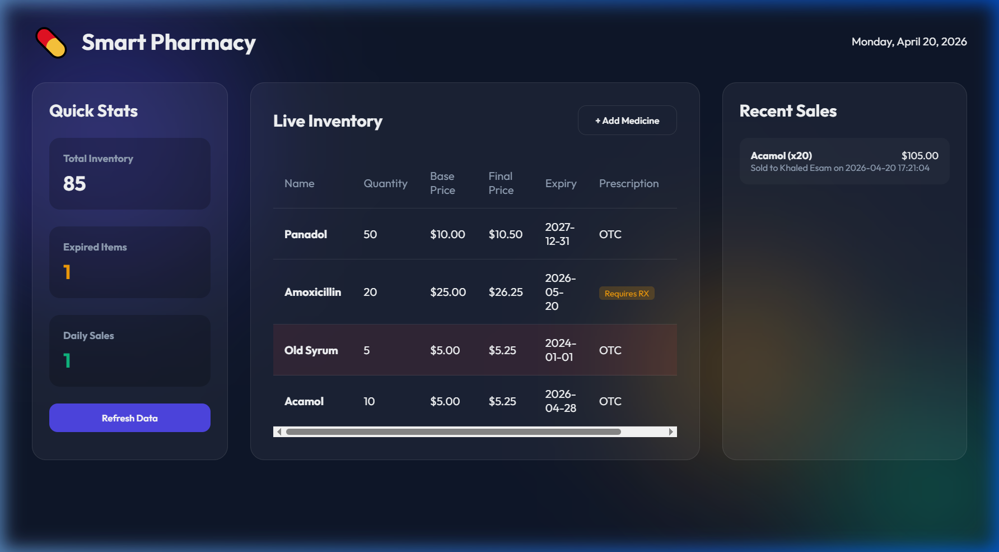

# 💊 Smart Pharmacy Management System

A modern web application for pharmacy inventory and sales management.

## 🚀 Overview
This system helps pharmacists track medicine stock, manage sales, and monitor expired products through a simple, responsive dashboard.

## 📸 Screenshot


## ✨ Features
- **Live Inventory**: Track medicine quantities and prices.
- **Sales Tracking**: Process customer sales with prescription verification.
- **Expiry Alerts**: Identify expired products instantly.
- **Responsive UI**: Works on Desktop, Tablet, and Mobile.

## 🛠️ Tech Stack
- **Backend**: Flask (Python)
- **Frontend**: HTML5, CSS3, JavaScript

## 🏃 Quick Start
1. **Install dependencies**:
   ```bash
   pip install flask
   ```
2. **Run the server**:
   ```bash
   python app.py
   ```
3. **Open the app**:
   Go to `http://127.0.0.1:5000/`

---
*Developed with ❤️ by **Khaled-Alabadla***